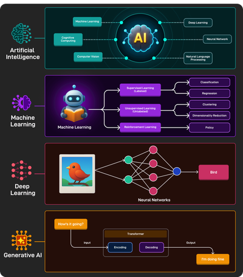
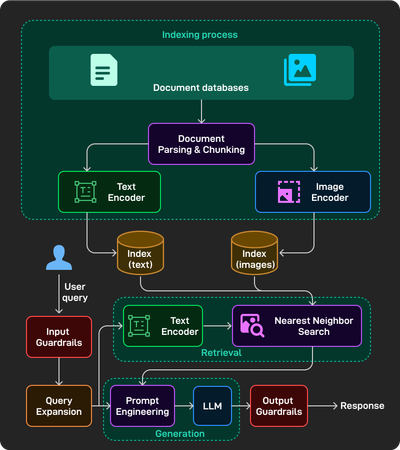
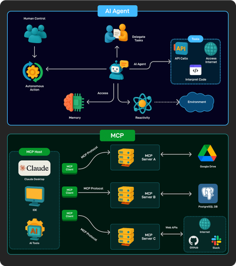
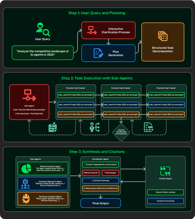
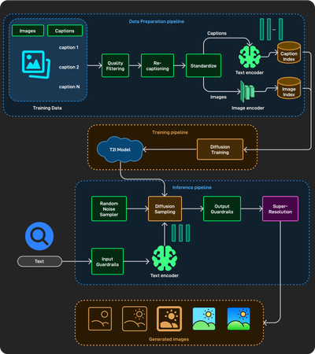
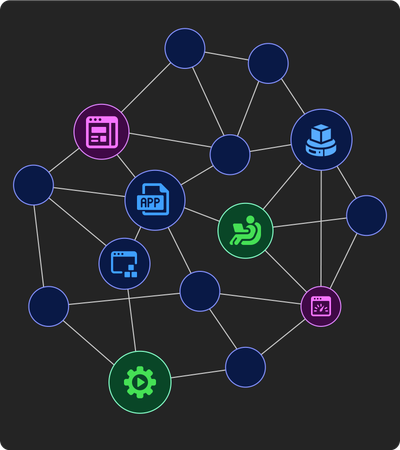

# AI Engineer course by projects

📖 **[คลังเอกสารการเรียนภาษาไทยฉบับละเอียด (Detailed Thai Lecture Notes)](lectures/README.md)**

## [Project 1 Build an LLM Playground](lectures/project1_llm_foundations.md)

- LLM Overview and Foundations
- Pre-Training
  - Data collection (manual crawling, Common Crawl)
  - Data cleaning (RefinedWeb, Dolma, FineWeb)
  - Tokenization (e.g., BPE)
  - Architecture (neural networks, Transformers, GPT family, DeepSeek, Qwen,
    Gemma)
  - Text generation (greedy and beam search, top-k, top-p)
- Post-Training
  - SFT
  - RL and RLHF (verifiable tasks, reward models, PPO, etc.)
- Evaluation
  - Traditional metrics
  - Task-specific benchmarks
  - Human evaluation and leaderboards
- Chatbots' Overall Design

## [Project 2 Build a Customer Support Chatbot using RAGs and Prompt Engineering](lectures/project2_rag_prompt_engineering.md)

- Overview of Adaptation Techniques
- Finetuning
  - Parameter-efficient fine-tuning (PEFT)
  - Adapters and LoRA
- Prompt Engineering
  - Few-shot and zero-shot prompting
  - Chain-of-thought prompting
  - Role-specific and user-context prompting
- RAGs Overview
- Retrieval
  - Document parsing (rule-based, AI-based) and chunking strategies
  - Indexing (keyword, full-text, knowledge-based, vector-based, embedding
    models)
- Generation
  - Search methods (exact and approximate nearest neighbor)
  - Prompt engineering for RAGs
- RAFT: Training technique for RAGs
- Evaluation (context relevance, faithfulness, answer correctness)
- RAGs' Overall Design

## [Project 3 Build an "Ask-the-Web" Agent similar to Perplexity with Tool calling](lectures/project3_agentic_workflows_tools.md)

- Agents Overview
  - Agents vs. agentic systems vs. LLMs
  - Agency levels (e.g., workflows, multi-step agents)
- Workflows
  - Prompt chaining
  - Routing
  - Parallelization (sectioning, voting)
  - Reflection
  - Orchestration-worker
- Tools
  - Tool calling
  - Tool formatting
  - Tool execution
  - MCP
- Multi-Step Agents
  - Planning autonomy
  - ReACT
  - Reflexion, ReWOO, etc.
  - Tree search for agents
- Multi-Agent Systems (challenges, use-cases, A2A protocol)
- Agent Evaluation

## [Project 4 Build "Deep Research" Capability with Web Search and Reasoning Models](lectures/project4_deep_research_reasoning.md)

- Reasoning and Thinking LLMs
  - Overview of reasoning models like OpenAI's "o" family and DeepSeek-R1
- Inference-time Techniques
  - Inference-time scaling
  - CoT prompting
  - Parallel sampling
  - Sequential sampling
  - Tree of Thoughts (ToT)
  - Search against a verifier
- Training-time techniques
  - SFT on reasoning data (e.g., STaR)
  - Reinforcement learning with a verifier
  - Reward modeling (ORM, PRM)
  - Self-refinement
  - Internalizing search (e.g., Meta-CoT)
- Local Deployment

## [Project 5 Build a Multi-modal Generation Agent](lectures/project5_multimodal_generation.md)

- Overview of Image and Video Generation
  - VAE
  - GANs
  - Auto-regressive models
  - Diffusion models
- Text-to-Image (T2I)
  - Data preparation
  - Diffusion architectures (U-Net, DiT)
  - Diffusion training (forward process, backward process)
  - Diffusion sampling
  - Evaluation (image quality, diversity, image-text alignment, IS, FID, and
    CLIP score)
- Text-to-Video (T2V)
  - Latent-diffusion modeling (LDM) and compression networks
  - Data preparation (filtering, standardization, video latent caching)
  - DiT architecture for videos
  - Large-scale training challenges
  - T2V's overall system

## [Project 6 Capstone Project](lectures/project6_capstone_guide.md)

- Ship a portfolio-ready AI project from idea to demo
  - Choose: pick your own idea, or start from a curated list
  - Build: implement using techniques from the course
  - Iterate: get real-time feedback from the instructor as you build
  - Optional Demo: present your project on final demo day
