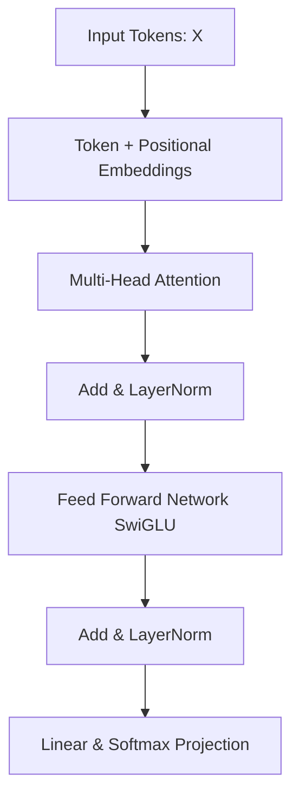

# Project 1: Build an LLM Playground - Textbook-Level Lecture Notes
[← กลับสู่หน้าหลัก (README.md)](../README.md)

---

## 1. LLM Overview and Foundations (ภาพรวมและรากฐานของ LLM)

### 1.1 รากฐานทางทฤษฎีและโมเดลภาษาเชิงสถิติ (Statistical Language Modeling)
โมเดลภาษาขนาดใหญ่ (Large Language Models หรือ LLM) ทำงานบนรากฐานทฤษฎีความน่าจะเป็นเชิงสถิติ โดยมีเป้าหมายในการจำลองการแจกแจงความน่าจะเป็นร่วม ([Joint Probability Distribution](../glossary/joint_probability.md)) ของลำดับคำในภาษาเขียน

สำหรับลำดับโทเคน $W = (w_1, w_2, \dots, w_T)$ ความน่าจะเป็นร่วมตามกฎลูกโซ่ ([Chain Rule of Probability](../glossary/chain_rule_probability.md)) สามารถคำนวณได้ดังนี้:

$$P(w_1, w_2, \dots, w_T) = \prod_{t=1}^T P(w_t \mid w_1, w_2, \dots, w_{t-1})$$

โมเดลภาษาแบบ [Autoregressive](../glossary/autoregressive.md) (เช่น GPT family) จะรับผิดชอบการทำนายโทเคนถัดไป (Next-Token Prediction) โดยการเรียนรู้พารามิเตอร์ $\theta$ ของฟังก์ชันความหนาแน่นความน่าจะเป็นแบบมีเงื่อนไข $P(w_t \mid w_{<t}; \theta)$ ผ่านโครงข่ายประสาทเทียมขนาดใหญ่

> [!TIP]
> **Code Example:** ลองศึกษาโค้ดจำลองกระบวนการสุ่มโทเคนแบบถัดไปผ่านไฟล์ [project1_autoregressive_loop.py](../code/project1_autoregressive_loop.py)
>
> ```python
> # ตัวอย่างฟังก์ชันหลักในไฟล์ (ดูโค้ดเต็มในลิงก์ด้านบน)
> def sample_next_token(logits, temperature=1.0, top_k=0):
>     # 1. Apply Temperature Scaling
>     # 2. Apply Top-K filtering
>     # 3. Softmax
>     # 4. Sample from the probability distribution
> ```

---

### 1.2 สถาปัตยกรรม Transformers (Transformer Architecture Deep-Dive)
สถาปัตยกรรม Transformer เปิดตัวครั้งแรกในงานวิจัย *Attention Is All You Need* (Vaswani et al., 2017) โดยยกเลิกการใช้กลไกการคำนวณแบบย้อนกลับตามลำดับเวลา (Recurrent Neural Networks - RNN) แล้วหันมาใช้กลไกลำดับความสนใจ (Self-Attention Mechanism) เพื่อช่วยการประมวลผลคำทั้งหมดขนานกัน



#### A. Scaled Dot-Product Attention
กลไก Attention ทำหน้าที่สแกนหาความสัมพันธ์ของคำต่าง ๆ ในประโยค โดยคำนวณจาก Query ($Q$), Key ($K$), และ Value ($V$) ดังนี้:

$$\text{Attention}(Q, K, V) = \text{softmax}\left(\frac{Q K^T}{\sqrt{d_k}}\right) V$$

โดยมิติของเมทริกซ์กำหนดโดย:
*   $Q \in \mathbb{R}^{N \times d_k}$ (Query matrix ของประโยคเป้าหมาย)
*   $K \in \mathbb{R}^{M \times d_k}$ (Key matrix ของประโยคอ้างอิง)
*   $V \in \mathbb{R}^{M \times d_v}$ (Value matrix ของข้อมูลดิบ)
*   ตัวหาร $\sqrt{d_k}$ ทำหน้าที่เป็น Scaling factor เพื่อป้องกันไม่ให้ผลลัพธ์ของ Dot product มีค่าสูงเกินไปจนส่งผลให้ฟังก์ชัน $\text{softmax}$ เข้าสู่โซนอิ่มตัว (Saturated region) ซึ่งส่งผลให้เกรเดียนต์หาย ([Vanishing Gradients](../glossary/vanishing_gradients.md))

#### B. รูปแบบ Attention: MHA, MQA, และ GQA
ในการขยายประสิทธิภาพโดยเฉพาะการลดขนาด KV Cache ในช่วงประมวลผล (Inference) มีการออกแบบการใช้หัวของ Attention ดังนี้:

*   **Multi-Head Attention (MHA)**: แต่ละหัวของ Attention จะมีเมทริกซ์ $Q$, $K$, $V$ เป็นของตัวเอง
*   **Multi-Query Attention (MQA)**: หัว Attention ทุกหัวจะใช้เมทริกซ์ $K$ และ $V$ ร่วมกันแผ่นเดียว โดยแยกเฉพาะเมทริกซ์ $Q$ ของตัวเอง ช่วยประหยัดพื้นที่จัดเก็บเวกเตอร์ในหน่วยความจำได้อย่างมหาศาล แต่แลกมาด้วยความแม่นยำที่ลดลงเล็กน้อย
*   **Grouped-Query Attention (GQA)**: แบ่งหัวของ Query ออกเป็นกลุ่ม ๆ และให้แต่ละกลุ่มแชร์ $K, V$ ร่วมกัน 1 ชุด เป็นทางเลือกสายกลางที่ได้รับความนิยมสูงในสถาปัตยกรรม Llama-3, Qwen2.5 และ Gemma 2

```text
MHA (Multi-Head Attention)   GQA (Grouped-Query Attention)   MQA (Multi-Query Attention)
  Q Q Q Q Q Q Q Q               [Q Q] [Q Q] [Q Q] [Q Q]          Q Q Q Q Q Q Q Q
  │ │ │ │ │ │ │ │                 │     │     │     │             \ \ \ / / / /
  K K K K K K K K                 K     K     K     K                    K
  V V V V V V V V                 V     V     V     V                    V
```

#### C. Rotary Position Embedding (RoPE)
เนื่องจาก Self-Attention ไม่มีลอจิกความเข้าใจลำดับคำโดยธรรมชาติ ([Permutation Invariant](../glossary/permutation_invariant.md)) โมเดลยุคใหม่จึงนำเทคนิค **Rotary Position Embedding (RoPE)** มาใช้แทนการบวก Positional Embedding แบบคงที่ (Absolute Position)
RoPE ทำการคูณเวกเตอร์ Query และ Key ด้วยเมทริกซ์การหมุน (Rotation Matrix) ในระนาบจำนวนเชิงซ้อนตามดัชนีตำแหน่ง $m$:

$$R^d_{\Theta, m} x = \text{diag}\left( R_{\theta_1, m}, R_{\theta_2, m}, \dots, R_{\theta_{d/2}, m} \right) x$$

โดยที่แผ่นย่อยระดับ 2 มิติคำนวณเป็น:

$$R_{\theta_i, m} = \begin{pmatrix} \cos(m\theta_i) & -\sin(m\theta_i) \\ \sin(m\theta_i) & \cos(m\theta_i) \end{pmatrix}$$

เทคนิคนี้ช่วยให้โมเดลประเมินระยะห่างสัมพัทธ์ (Relative distance) ระหว่างโทเคนสองตัวได้ดีขึ้น และเปิดช่องให้สามารถสเกล Context window ไปได้ไกลผ่านการแทรกสอดมุมหมุน (RoPE Interpolation)

#### D. Activation Functions และ Normalization
*   **SwiGLU (Swish Gated Linear Unit)**: ฟังก์ชันประตุ้นยอดนิยมใน FFN block ที่รวมความสามารถของ Swish และ Gated Linear Unit เข้าด้วยกัน:
    $$\text{SwiGLU}(x) = \text{Swish}_\beta(x W_g) \odot (x W_u)$$
    เมื่อเทียบกับ ReLU หรือ GELU แบบเก่า SwiGLU จะช่วยเพิ่มความลื่นไหลของเกรเดียนต์และส่งผลให้การเทรนโมเดลลู่เข้าจุดเหมาะสมได้รวดเร็วขึ้น
*   **RMSNorm (Root Mean Square Normalization)**: ปรับปรุงความเร็วจาก LayerNorm แบบดั้งเดิมโดยตัดส่วนการคำนวณค่าเฉลี่ย (Mean Shift) ออกไป แล้วคำนวณเฉพาะผลเฉลี่ยกำลังสองเพื่อทำสเกลเท่านั้น:
    $$\bar{a}_i = \frac{a_i}{\text{RMS}(a)} \gamma_i, \quad \text{where} \quad \text{RMS}(a) = \sqrt{\frac{1}{d} \sum_{j=1}^d a_j^2 + \epsilon}$$

---

## 2. Pre-Training (กระบวนการพรีเทรน)

### 2.1 Data Collection & Data Cleaning (กระบวนการรวบรวมและล้างข้อมูล)
ในระดับอุตสาหกรรม การเตรียมข้อมูลมีความสำคัญมากกว่าตัวสถาปัตยกรรมโมเดล กระบวนการล้างข้อมูลเว็บสเกลขนาดใหญ่ (เช่น Common Crawl) ประกอบด้วยขั้นตอนที่ซับซ้อน:

```text
[Raw Web Data] ──> [Text Extraction] ──> [Language Identification] ──> [Quality Filters] ──> [Deduplication]
```

1.  **Quality Filters (Heuristics)**:
    *   **Word-count & Character-count rules**: คัดแยกเอกสารที่มีจำนวนคำสั้นหรือยาวเกินไป เช่น มีอัตราส่วนสัญลักษณ์พิเศษ ($...$, $\#$, $@$) สูงเกินไป
    *   **Perplexity filtering**: ใช้โมเดลภาษาขนาดเล็ก (เช่น FastText หรือ KenLM) คำนวณหาค่า Perplexity ของแต่ละหน้าเอกสาร หากค่าสูงเกินไปแสดงว่ามีข้อความขยะ/สปามสูง และจะถูกตัดออก
2.  **Deduplication (การกำจัดข้อมูลซ้ำซ้อน)**:
    *   **MinHash & LSH (Locality-Sensitive Hashing)**: การหาเอกสารที่เกือบเหมือนกัน (Near-duplicate) โดยเปลี่ยนเอกสารเป็นชุด Shingles (เช่น 5-gram ของตัวอักษร) แล้วหาค่าดัชนี [Jaccard Similarity](../glossary/jaccard_similarity.md) ของเอกสารล้าน ๆ แผ่นได้อย่างรวดเร็ว

---

### 2.2 Tokenization (Byte-Pair Encoding - BPE)
BPE เป็นอัลกอริทึมย่อยคำ (Subword Tokenization) ที่ใช้สร้างพจนานุกรมโทเคน

#### อัลกอริทึม BPE ทีละขั้นตอน (Textbook Style):
1.  **ขั้นตอนเริ่มต้น**: แยกคำทั้งหมดในคลังข้อความออกมาเป็นตัวอักษรเดี่ยว (รวมสัญลักษณ์พิเศษปิดท้ายคำ)
2.  **การหาคู่ความถี่**: นับจำนวนคู่ของโทเคนที่ติดกัน (token pairs) ที่มีความถี่ในการปรากฏร่วมกันสูงที่สุดในคลังข้อความ
3.  **การรวมกลุ่ม**: ยุบรวมคู่ที่มีความถี่สูงสุดนั้นเข้าด้วยกันเป็นโทเคนใหม่เดี่ยว ๆ
4.  **การทำซ้ำ**: ทำขั้นตอน 2-3 ซ้ำไปเรื่อย ๆ จนกระทั่งมีขนาดพจนานุกรมครบตามโควตาที่กำหนด (Vocabulary Size) เช่น 32,000 หรือ 151,936 โทเคน

---

### 2.3 Text Generation Decoding Algorithms (ทฤษฎีการสร้างคำตอบ)
การสุ่มโทเคนถัดไปจะเริ่มจาก Output Logits ของโมเดล $z$ ซึ่งถูกส่งผ่านฟังก์ชัน [$\text{softmax}$](../glossary/softmax.md) ร่วมกับพารามิเตอร์ควบคุม:

$$P(w_i) = \frac{\exp(z_i / T)}{\sum_j \exp(z_j / T)}$$

1.  **Top-k Sampling**: กรองเฉพาะสมาชิกที่มีค่าความน่าจะเป็นสูงสุด $k$ ตัวแรก
2.  **Top-p (Nucleus) Sampling**: คัดเฉพาะเซ็ตย่อยของโทเคนที่สอดคล้องกับความน่าจะเป็นสะสมเกินขอบเขตที่ตั้งไว้:
    $$\sum_{i \in V^{(p)}} P(w_i) \ge p$$
3.  **Beam Search with Length Penalty**: ระบบจะสร้างความน่าจะเป็นของประโยคตามเส้นทางเดิน พร้อมทั้งคิดค่าลดหย่อนความยาวเพื่อไม่ให้โมเดลตอบสั้นหรือยาวไปโดยไร้เหตุผล:
    $$S(Y) = \frac{\sum_{t=1}^{|Y|} \log P(y_t \mid y_{<t}, X)}{(|Y| + \alpha)^\beta}$$

---

## 3. Post-Training (กระบวนการหลังพรีเทรน)

### 3.1 Supervised Fine-Tuning (SFT)
SFT เป็นการจูนโมเดลด้วยคู่ข้อมูลชุดแชตเพื่อเปลี่ยนพฤติกรรมจากตัวทำนายคำถัดไปอย่างไร้กรอบ สู่ผู้ช่วยตอบรับคำสั่ง ฟังก์ชันเป้าหมายคือการหาค่าน้ำหนักเพื่อลดค่า Cross-entropy Loss บนโทเคนผลลัพธ์ (Response tokens) เท่านั้น:

$$\mathcal{L}_{\text{SFT}}(\theta) = -\sum_{i=\text{start\_response}}^{\text{end\_response}} \log P(w_i \mid w_{<i}; \theta)$$

---

### 3.2 RLHF (Reinforcement Learning from Human Feedback)

#### A. Reward Model Training
โมเดลให้รางวัลเรียนรู้จากคู่คำตอบที่มนุษย์จัดอันดับความชอบ $(y_w, y_l)$ โดยที่ $y_w$ คือคำตอบที่ชอบมากกว่า (Winning) และ $y_l$ คือคำตอบที่ชอบน้อยกว่า (Losing) ฟังก์ชัน Loss สำหรับเทรน Reward Model ($r_\psi$) คือ:

$$\mathcal{L}_{\text{RM}}(\psi) = -\mathbb{E}_{(x, y_w, y_l)} \left[ \log \sigma \left( r_\psi(x, y_w) - r_\psi(x, y_l) \right) \right]$$

#### B. PPO (Proximal Policy Optimization)
หลังจากได้ Reward Model แล้ว จะทำการปรับแต่งค่าน้ำหนักของโมเดลนโยบาย ($\pi_\theta$) ผ่าน PPO โดยมีฟังก์ชันเป้าหมายที่คำนึงถึงความต่างจากโมเดลเริ่มต้นเพื่อไม่ให้พฤติกรรมโมเดลเบี้ยวเสียหาย (KL divergence penalty):

$$\mathcal{L}_{\text{PPO}}(\theta) = \hat{\mathbb{E}}_t \left[ \min\left(r_t(\theta)\hat{A}_t, \text{clip}(r_t(\theta), 1-\epsilon, 1+\epsilon)\hat{A}_t\right) \right] - \beta \mathbb{D}_{\text{KL}}(\pi_\theta \parallel \pi_{\text{SFT}})$$

โดยที่ $r_t(\theta) = \frac{\pi_\theta(a_t \mid s_t)}{\pi_{\text{old}}(a_t \mid s_t)}$ และ $\hat{A}_t$ คือค่าประมาณค่าความได้เปรียบ (Advantage)

#### C. GRPO (Group Relative Policy Optimization)
สถาปัตยกรรมระดับสูงที่ตัดโมเดลผู้ให้คะแนนวิจารณ์ (Critic Network) ออกไป เพื่อลดการกินทรัพยากรบน GPU (ใช้ใน DeepSeek) โดยการสุ่มชุดคำตอบกลุ่มหนึ่ง $\{y_1, y_2, \dots, y_G\}$ จากคำถามเดียวกัน และประเมินคะแนนสะสมเปรียบเทียบในกลุ่มด้วยค่าเฉลี่ยและส่วนเบี่ยงเบนมาตรฐาน:

$$\tilde{r}_i = \frac{r(x, y_i) - \text{mean}(\{r(x, y_j)\})}{\text{std}(\{r(x, y_j)\})}$$

---

## 4. Evaluation Metrics (คณิตศาสตร์ของการประเมินผล)

### 4.1 Perplexity (PPL)
ความสับสนของภาษา (Perplexity) วัดระดับความน่าจะเป็นที่สะสมตลอดเอกสาร โดยคำนวณจากค่าเฉลี่ยของ [Cross-Entropy Loss](../glossary/cross_entropy_loss.md):

$$\text{PPL} = \exp\left(-\frac{1}{N} \sum_{i=1}^N \log P(w_i \mid w_{<i})\right)$$

> [!TIP]
> **Code Example:** ทำความเข้าใจที่มาของตัวเลขด้วยโค้ดจำลอง [project1_softmax_cross_entropy.py](../code/project1_softmax_cross_entropy.py)
> 
> ```python
> # ตัวอย่างการคำนวณ Cross-Entropy (ดูโค้ดเต็มในลิงก์ด้านบน)
> def cross_entropy_loss(probabilities, target_index):
>     epsilon = 1e-12 # ป้องกัน log(0)
>     return -np.log(probabilities[target_index] + epsilon)
> ```

---

### 4.2 BLEU (Bilingual Evaluation Understudy)
วัดค่าความแม่นยำของคำ $n$-gram เทียบระหว่างผลลัพธ์โมเดลและคำตอบต้นฉบับ พร้อมกับค่าปรับหย่อนความสั้น (Brevity Penalty - BP):

$$\text{BLEU} = \text{BP} \cdot \exp\left( \sum_{n=1}^N w_n \log p_n \right)$$

$$\text{BP} = \begin{cases} 1 & \text{if } c > r \\ \exp(1 - r/c) & \text{if } c \le r \end{cases}$$

โดยที่ $c$ คือความยาวประโยคผลผลิต และ $r$ คือความยาวประโยคเฉลย

---

### 4.3 ROUGE-L
วัดคะแนนโดยอาศัยความยาวลำดับตัวอักษรย่อยร่วมกันที่ยาวที่สุด (Longest Common Subsequence - LCS):

$$R_{\text{LCS}} = \frac{\text{LCS}(X, Y)}{m}, \quad P_{\text{LCS}} = \frac{\text{LCS}(X, Y)}{n}$$

$$F_{\text{LCS}} = \frac{(1 + \beta^2) R_{\text{LCS}} P_{\text{LCS}}}{R_{\text{LCS}} + \beta^2 P_{\text{LCS}}}$$

---

## 5. System Design: KV Cache Memory Calculation

สิ่งสำคัญสำหรับ AI Engineer ในการจัดสรรเซิร์ฟเวอร์เพื่อรองรับแชตบอตคือการประเมินการใช้งาน GPU VRAM ของ **Key-Value Cache** สำหรับเก็บประวัติการคุย

สูตรคำนวณขนาดหน่วยความจำ KV Cache สำหรับการสุ่มผลลัพธ์ (หน่วยเป็น Bytes):

$$\text{KV Cache Size (Bytes)} = 2 \times B \times L \times H_{kv} \times d_{\text{head}} \times S \times \text{BytesPerParam}$$

โดยที่พารามิเตอร์กำหนดโดย:
*   $2$: ตัวคูณสะสมสำหรับจัดเก็บทั้งเวกเตอร์ $K$ และเวกเตอร์ $V$
*   $B$: ขนาดของกลุ่มการรันพร้อมกัน (Batch Size)
*   $L$: จำนวนชั้นประมวลผลของโมเดล (Number of Layers)
*   $H_{kv}$: จำนวนหัว Attention สำหรับบันทึก $K, V$ (ถ้าเป็น MHA คือจำนวนหัวปกติ, ถ้าเป็น GQA คือจำนวนกลุ่มหัว)
*   $d_{\text{head}}$: มิติพิกเซลย่อยในแต่ละหัวของ Attention (ปกติเท่ากับ $\frac{d_{\text{model}}}{H_{\text{query}}}$)
*   $S$: ความยาวประวัติของคำสนทนาสะสมทั้งหมด (Sequence Length ในหน่วยโทเคน)
*   $\text{BytesPerParam}$: ค่าจำนวนไบต์ของฟอร์แมตข้อมูล (เช่น FP16/BF16 = 2 Bytes, INT8 = 1 Byte, FP8 = 1 Byte)

#### ตัวอย่างการคำนวณจริง:
สำหรับโมเดล Llama-3-8B ($L=32$, $H_{kv}=8$, $d_{\text{head}}=128$) ทำงานบน Batch Size $B=16$, สเกลความยาว Sequence $S=4096$ โทเคน ด้วยระบบประมวลผลขนาด 16 บิต (BF16 = 2 Bytes):

$$\text{KV Cache} = 2 \times 16 \times 32 \times 8 \times 128 \times 4096 \times 2 = 536,870,912 \text{ Bytes} \approx 536.87 \text{ MB}$$

---
[← กลับสู่หน้าหลัก (README.md)](../README.md)
