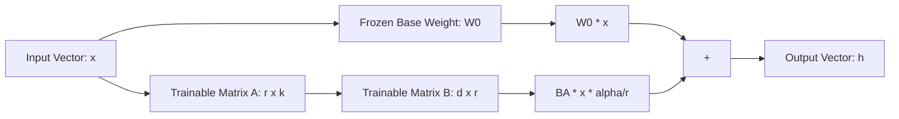

# Project 2: Build a Customer Support Chatbot using RAGs and Prompt Engineering - Textbook-Level Lecture Notes

[← กลับสู่หน้าหลัก (README.md)](../README.md)

---

## 1. Finetuning (กระบวนการปรับจูนน้ำหนักและเทคนิค PEFT)

เมื่อโมเดลพื้นฐาน (Base Model) มีความเข้าใจภาษาทั่วไปแล้ว
แต่ขาดความเข้าใจรูปแบบเฉพาะเจาะจงหรือสไตล์การตอบสนองเชิงวิชาชีพ เราสามารถนำเทคนิค **PEFT
(Parameter-Efficient Fine-Tuning)**
มาประยุกต์ใช้เพื่อปรับแต่งโมเดลโดยไม่ต้องเทรนพารามิเตอร์ทั้งหมด

### 1.1 คณิตศาสตร์ของ LoRA (Low-Rank Adaptation)

LoRA (Hu et al., 2021) ตั้งอยู่บนสมมติฐานที่ว่าการปรับแต่งค่าน้ำหนักของโมเดลมีค่า **Intrinsic
Rank** (อันดับความสำคัญจำเพาะภายใน) ที่ต่ำมาก

สมมติว่าค่าน้ำหนักเดิมของโมเดลคือเมทริกซ์ $W_0 \in \mathbb{R}^{d \times k}$
ในการคำนวณการเรียนรู้แบบดั้งเดิม ค่าน้ำหนักจะถูกปรับเปลี่ยนไปเป็น $W = W_0 + \Delta W$ แต่สำหรับ
LoRA เราจะแบ่งเมทริกซ์การแปลง $\Delta W \in \mathbb{R}^{d \times k}$
ออกเป็นผลคูณของเมทริกซ์ขนาดเล็กสองตัวที่มีขนาดอันดับ (Rank) $r$ โดยที่ $r \ll \min(d, k)$:

$$\Delta W = B \cdot A$$

โดยที่:

- $A \in \mathbb{R}^{r \times k}$ เริ่มต้นด้วยการแจกแจงแบบปกติ
  ([Gaussian Distribution](../glossary/gaussian_distribution.md)) เช่น
  $\mathcal{N}(0, \sigma^2)$
- $B \in \mathbb{R}^{d \times r}$ เริ่มต้นด้วยค่าศูนย์ทั้งหมด ($0$)
  ส่งผลให้ในการเริ่มรันรอบแรกสุด $\Delta W = 0$
- สำหรับพาสการคำนวณไปข้างหน้า ([Forward Pass](../glossary/forward_pass.md)) ของ
  Layer จะคำนวณดังนี้:

$$h = W_0 x + \Delta W x = W_0 x + \frac{\alpha}{r} (B A) x$$

โดยที่ $\alpha$ คือค่าคงที่ในการช่วยปรับขนาด (Scaling factor)
เพื่อช่วยในการเทรนเมื่อมีการปรับค่า Rank $r$



### 1.2 QLoRA (Quantized Low-Rank Adaptation)

QLoRA (Dettmers et al., 2023) ยกระดับ LoRA โดยการประหยัด VRAM เพิ่มเติมผ่าน 3
เทคนิคหลัก:

1. **NF4 (NormalFloat 4-bit)**:
   ชนิดข้อมูลแบบพิเศษที่มีการกระจายความถี่ที่เหมาะสมกับน้ำหนักโมเดลซึ่งมักมีการแจกแจงแบบโค้งปกติ
2. **Double Quantization (DQ)**: บีบอัดค่าน้ำหนักตัวแปรสเกล (Quantization constants)
   เพิ่มเติม ช่วยประหยัดพื้นที่ VRAM ไปอีกประมาณ 0.37 GB สำหรับโมเดลขนาด 7B
3. **Paged Optimizers**: ย้ายหน่วยความจำของ Optimizer (เช่น AdamW states)
   ไปไว้บนหน่วยความจำระบบทั่วไป (CPU RAM) ชั่วคราว เมื่อเกิดปัญหาหน่วยความจำบนการ์ดจอขาดแคลน
   (VRAM Spike) ป้องกันปัญหา Out-Of-Memory (OOM)

---

## 2. Prompt Engineering (ทฤษฎีวิศวกรรมการออกแบบพร้อมต์)

### 2.1 ทฤษฎีของ In-Context Learning (ICL)

จากมุมมองงานวิจัยล่าสุด (เช่น von Oswald et al., 2023)
การที่โมเดลสามารถเรียนรู้จากตัวอย่างประกอบในพร้อมต์ (Few-shot learning)
โดยไม่มีการปรับค่าน้ำหนักเลย สามารถอธิบายทางคณิตศาสตร์ได้ว่าเป็น
**[Implicit Gradient Descent](../glossary/implicit_gradient_descent.md)**
(การอัปเกรดเกรเดียนต์โดยนัย) ภายในกลไก Attention ของตัวแบบ

การนำตัวอย่างคู่คำสั่ง-คำตอบป้อนเข้าไปในบริบท จะสร้างความสัมพันธ์สะสมเชิงโครงสร้างในเวกเตอร์ Key
และ Value ซึ่งเมื่อโมเดลรับ Query ตัวใหม่เข้ามา กลไกของ Attention จะทำการส่งผ่านข้อมูล
(Projection) คล้ายคลึงกับพาสการแก้ไขของเกรเดียนต์ในรอบการเทรนปกติ

### 2.2 Chain-of-Thought (CoT) และทฤษฎีการใช้พื้นที่คำนวณเสริม (Scratchpad)

CoT ช่วยเพิ่มประสิทธิภาพในโจทย์ตรรกะและคณิตศาสตร์ เพราะการบังคับให้โมเดลสร้างขั้นตอนการคิดยาว ๆ
จะเทียบเท่ากับการเพิ่มพื้นที่จดบันทึกตัวแปร (Scratchpad Memory)
ยิ่งโมเดลมีโอกาสรันโทเคนขั้นตอนการคิดสะสมในบริบทมากเท่าใด
โมเดลก็จะมีขนาดบริบทในการคำนวณและดึงความรู้เฉพาะทางที่แม่นยำขึ้นเท่านั้น

---

## 3. Retrieval-Augmented Generation (RAG)

### 3.1 Document Chunking Strategies (กลวิธีแบ่งชิ้นข้อมูล)

- **Recursive Character Text Splitter**: แบ่งเอกสารย่อยโดยพยายามรักษาโครงสร้างย่อหน้า
  ประโยค และคำ โดยการประเมินจากชุดสัญลักษณ์แยกคำล่วงหน้า (เช่น
  `["\n\n", "\n", " ", ""]`)
- **Semantic Chunking**: ใช้โมเดล Embedding แปลงแต่ละประโยคเป็นเวกเตอร์
  จากนั้นวัดค่าระยะห่างเวกเตอร์ (Cosine Distance) ระหว่างประโยคที่อยู่ติดกัน
  หากค่าความต่างสูงเกินกว่าจุดแบ่ง (threshold) ที่กำหนด แสดงว่าหัวข้อเริ่มเปลี่ยน
  และจะทำการตัดเป็นชิ้นข้อมูล (Chunk) แผ่นใหม่

---

### 3.2 Retrieval Indexing (คณิตศาสตร์ของระบบค้นหา)

#### A. Sparse Retrieval: BM25

BM25 เป็นโมเดลค้นคืนเชิงคำหลัก (Keyword-based)
ที่ใช้ความถี่ของคำในการให้คะแนนความสัมพันธ์ของเอกสาร $D$ กับข้อความสืบค้น $Q$:

$$\text{Score}(D, Q) = \sum_{i=1}^n \text{IDF}(q_i) \cdot \frac{f(q_i, D) \cdot (k_1 + 1)}{f(q_i, D) + k_1 \cdot \left(1 - b + b \cdot \frac{|D|}{\text{avgdl}}\right)}$$

โดยที่:

- $f(q_i, D)$ คือความถี่ของคำค้นหา $q_i$ ในเอกสาร $D$
- $|D|$ และ $\text{avgdl}$ คือความยาวเอกสาร $D$
  และความยาวเฉลี่ยของเอกสารทั้งหมดในคลังตามลำดับ
- $k_1$ และ $b$ คือพารามิเตอร์ปรับแต่งค่าคงที่ (โดยทั่วไปกำหนดให้ $k_1 \in [1.2, 2.0]$ และ
  $b = 0.75$)
- $\text{IDF}(q_i)$ คือน้ำหนักความถี่ผกผันในคลังเอกสารสะสมทั้งหมด:
  $$\text{IDF}(q_i) = \ln \left( \frac{N - n(q_i) + 0.5}{n(q_i) + 0.5} + 1 \right)$$

#### B. Dense Retrieval (เวกเตอร์ความสัมพันธ์เชิงความหมาย)

ใช้ระยะห่างทางคณิตศาสตร์ในการวัดความสัมพันธ์ใน Vector Space:

- **Cosine Similarity**: $$\text{Cosine}(u, v) = \frac{u \cdot v}{\|u\| \|v\|}$$
- **Dot Product**: $$\text{DotProduct}(u, v) = u \cdot v$$
- **Euclidean Distance (L2)**: $$\text{L2}(u, v) = \sqrt{\sum_i (u_i - v_i)^2}$$

#### C. Hybrid Search & Reciprocal Rank Fusion (RRF)

RRF ทำหน้าที่ผสานผลลัพธ์ของคะแนนค้นหาจากสองระบบย่อย (เช่น ลำดับจาก BM25 และลำดับจาก Vector
search) ให้เป็นลำดับรวมชุดเดียวที่มีประสิทธิภาพสูงสุด:

$$\text{RRF\_Score}(d \in D) = \sum_{m \in M} \frac{1}{k + r_m(d)}$$

โดยที่ $r_m(d)$ คืออันดับของเอกสาร $d$ ในระบบการค้นหาช่องทาง $m$ และ $k$
คือค่าคงที่ช่วยชะลอการดิ่งลงของอันดับ (ปกติเลือกใช้ $k = 60$)

---

### 3.3 Generation: Approximate Nearest Neighbor (ANN) Algorithms

#### A. HNSW (Hierarchical Navigable Small World)

HNSW เป็นสถาปัตยกรรมกราฟหลายเลเยอร์ (Hierarchical Graph)
เพื่อใช้ค้นหาเวกเตอร์ที่ใกล้เคียงที่สุดในเวลาที่รวดเร็ว ($O(\log N)$):

- **Layer 0 (ล่างสุด)**: เก็บเวกเตอร์ทั้งหมดในฐานข้อมูลพร้อมลิงก์เชื่อมต่อกราฟหนาแน่นที่สุด
- **Layer สูงขึ้นไป**: เก็บเวกเตอร์เฉพาะบางส่วนแบบกระจายห่าง ๆ (คล้ายข้ามผ่านจุดสำคัญ)
- **กระบวนการค้นหา**: เริ่มจากเลเยอร์บนสุด ค้นหาจุดที่ใกล้เคียงที่สุดในกิ่งนั้น
  แล้วกระโดดลงไปที่เลเยอร์ต่ำกว่าในตำแหน่งพิกัดเดียวกันเพื่อค้นรายละเอียดเพิ่มเติมแบบนี้เรื่อย ๆ
  จนถึงเลเยอร์ล่างสุด

```text
Layer 2 (Sparse)      ●───────────────●───────────────●
                      │               │               │
Layer 1 (Medium)      ●───────●───────●───────●───────●
                      │       │       │       │       │
Layer 0 (Dense)       ●─●─●─●─●─●─●─●─●─●─●─●─●─●─●─●─●
```

#### B. IVF-PQ (Inverted File Index with Product Quantization)

1. **IVF (Inverted File)**: ทำการแบ่งกลุ่มพื้นที่เวกเตอร์ออกเป็นคลัสเตอร์จำนวน $K$ กลุ่ม (ใช้
   [K-Means](../glossary/k_means_clustering.md))
   ในการค้นหาจริงจะมุ่งเป้าหาเฉพาะคลัสเตอร์ที่ใกล้ที่สุด ช่วยประหยัดเวลาการค้นหาลงได้อย่างมหาศาล

> [!TIP]
> **Code Example:** ลองดูตัวอย่างการจำลองกลไก K-Means ใน IVF ได้ที่ไฟล์
> [project2_vector_search_ivf.py](../code/project2_vector_search_ivf.py)
>
> ```python
> # โค้ดจำลองการทำ Inverted File Index (ดูโค้ดเต็มในลิงก์ด้านบน)
> class IVFFlatIndex:
>     def train(self, vectors):
>         self.kmeans = KMeans(n_clusters=self.num_clusters)
>         self.kmeans.fit(vectors)
>         
>     def search(self, query, nprobe=1):
>         # หาคลัสเตอร์เป้าหมาย nprobe กลุ่ม เพื่อลดเวลาค้นหา
>         pass
> ```

2. **PQ (Product Quantization)**: บีบอัดเวกเตอร์ต้นทางโดยหั่นเวกเตอร์ $D$-มิติ
   ออกเป็นส่วนย่อย $M$ ส่วนเท่า ๆ กัน จากนั้นทำ [Centroid](../glossary/centroid.md)
   clustering บนมิตย่อยเหล่านั้นเพื่อแปลงตัวเลขทศนิยมให้กลายเป็นชุดดัชนี Byte ขนาดเล็ก
   ช่วยประหยัดพื้นที่การใช้แรมบน Vector DB

---

## 4. RAFT (Retrieval-Augmented Fine-Tuning)

RAFT (Zhang et al., 2024) ผสมผสาน RAG และ SFT
เพื่อฝึนฝนโมเดลให้ตอบคำถามอย่างตรงประเด็นเสมือนผู้เชี่ยวชาญที่กำลังสอบแบบเปิดตำรา

### รูปแบบโครงสร้างชุดข้อมูลเทรน RAFT:

- สำหรับโจทย์แต่ละข้อ $Q$ ชุดข้อมูลจะประกอบด้วยเอกสาร 2 กลุ่ม:
  - **Oracle Document ($D^*$)**: เอกสารที่มีเบาะแสหรือข้อมูลเฉลยที่ถูกต้องจริง
  - **Distractor Documents ($D_1, \dots, D_k$)**: เอกสารลวงที่ไม่เกี่ยวข้องกับเฉลยเลย
    ดึงมาเพื่อให้โมเดลหัดกรองขยะออก
- เราจะแบ่งสัดส่วนการเทรนออกเป็น 2 ประเภท:
  1. **% ของชุดข้อมูลที่มีเอกสาร Oracle แนบไปด้วย**:
     โมเดลเรียนรู้การคัดกรองคำตอบจากบริบทที่กำหนด
  2. **% ของชุดข้อมูลที่ไม่มีเอกสาร Oracle (มีเฉพาะเอกสารลวง)**:
     บังคับให้โมเดลจำเป็นต้องใช้ความรู้ดิบ (Internal Knowledge)
     ที่เรียนมาจากช่วงพรีเทรนในการตอบ

---

## 5. RAG Evaluation Metrics (คณิตศาสตร์ของตัวประเมินผล RAG)

การวัดผลระบบค้นคืนมักใช้กรอบคำนวณทางสถิติผ่านการประเมินด้วยโมเดลระดับสูง (LLM-as-a-Judge):

### 5.1 Context Precision

วัดความคุ้มค่าของการดึงข้อมูลขึ้นมา โดยวิเคราะห์ว่าเอกสารที่เกี่ยวข้องจริง (Oracle)
ถูกจัดให้อยู่ในลำดับต้น ๆ (Top ranks) ของผลลัพธ์การค้นคืนหรือไม่:

$$\text{Context Precision} = \frac{\sum_{k=1}^K \left( P@k \times \mathbb{I}(d_k \text{ is relevant}) \right)}{\text{Total Relevant Documents}}$$

โดยที่ $P@k$ คือค่าความแม่นยำ ณ อันดับที่ $k$ (Precision at $k$):

$$P@k = \frac{\text{Relevant docs within top } k \text{ items}}{k}$$

---

### 5.2 Context Recall

วัดความครอบคลุมของข้อมูล โดยวิเคราะห์ว่าประเด็นสำคัญในเฉลยทั้งหมด (Ground Truth)
ปรากฏอยู่ในเอกสารที่ระบบดึงมาได้หรือไม่:

$$\text{Context Recall} = \frac{|\text{Ground Truth statements that can be attributed to Context}|}{|\text{Total statements in Ground Truth}|}$$

---

### 5.3 Faithfulness (ความจริงใจ/ไม่มีการหลอนข้อมูล)

วัดระดับสัจจะของคำตอบ โดยวิเคราะห์ว่าทุก ๆ ข้อความอ้างอิงหลักในคำตอบสุดท้ายที่สร้างขึ้น ($A$)
สามารถตรวจสอบย้อนกลับไปยังข้อความจริงในบริบทที่ดึงมา ($C$) ได้ครบถ้วนหรือไม่:

$$\text{Faithfulness} = \frac{|\text{Statements in } A \text{ that can be inferred from } C|}{|\text{Total statements in } A|}$$

---

[← กลับสู่หน้าหลัก (README.md)](../README.md)
