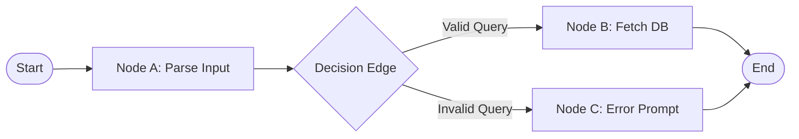
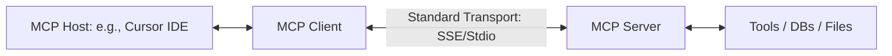
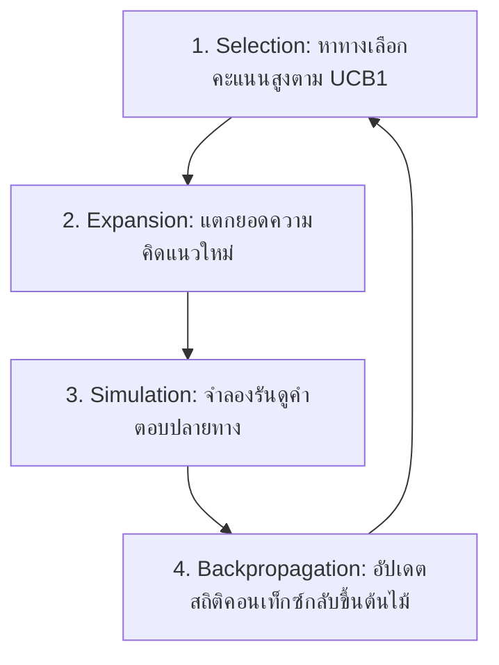

# Project 3: Build an "Ask-the-Web" Agent similar to Perplexity with Tool calling - Textbook-Level Lecture Notes
[← กลับสู่หน้าหลัก (README.md)](../README.md)

---

## 1. Agents Overview (ทฤษฎีระบบตัวแทนอัตโนมัติ)

ระบบเอเจนต์ (Agentic System) แตกต่างจากระบบการทำงานดั้งเดิม (Imperative Software) ตรงที่มีการใช้ LLM ในการวางลอจิกระดับการตัดสินใจและควบคุมการทำงานด้วยตนเอง

ในการสร้างระบบเอเจนต์ เรามักจำลองสภาวะแวดล้อมโดยอิงจาก **[Markov Decision Process](../glossary/markov_decision_process.md) (MDP)** หรือการแปลงสถานะของระบบเชิงกราฟ โดยเอเจนต์จะประเมินสถานะปัจจุบัน (State $S_t$) ผ่านบริบทของการสนทนาเพื่อเลือกทำกิจกรรม (Action $A_t$) ซึ่งจะส่งผลให้ระบบขยับไปสู่สถานะถัดไป (State $S_{t+1}$) และนำข้อสังเกตการณ์ที่ได้กลับมาประมวลผลต่อ

---

## 2. Workflows (สถาปัตยกรรมระดับการควบคุม)

การกำหนดทิศทางการไหลของข้อมูลแบบชัดเจน (Deterministic Flow) ในระดับแอปพลิเคชันช่วยให้งานมีความมั่นคงขึ้นเมื่อเทียบกับการปล่อยให้เอเจนต์ดำเนินงานอย่างอิสระ 100%

### 2.1 State Machines และทอพอโลยีการเชื่อมต่อ (Topologies)
โมเดลการควบคุมเอเจนต์ยุคใหม่ (เช่น LangGraph) จัดระเบียบระบบเป็นกราฟระบุทิศทาง ([Directed Graph](../glossary/directed_graph.md)) ประกอบด้วย:
*   **Nodes (โหนด)**: ฟังก์ชันประมวลผลหรือจุดรันคำขอของโมเดล (LLM calls / Tool runs)
*   **Edges (เส้นเชื่อม)**: กำหนดเงื่อนไขการส่งต่อข้อมูล (Conditional routing edges)
*   **State (ตัวแปรสถานะร่วม)**: โครงสร้างข้อมูลส่วนกลางที่แชร์ข้อมูลร่วมกันทุกโหนด โดยมีการอัปเดตแบบเพิ่มค่าอย่างเดียว (Append-only) หรือลดทอนตัวแปรเฉพาะจุด



---

## 3. Tools and Function Calling (เครื่องมือและการเชื่อมต่อภายนอก)

### 3.1 กลไกการยิงเรียกใช้เครื่องมือ (Function Calling Mechanics)
1.  **[JSON Schema](../glossary/json_schema.md) Specification**: โครงสร้างคำอธิบายรายละเอียดที่ใช้แจ้งให้โมเดลเข้าใจระบบตัวแปรที่รับได้ ตัวอย่างรูปแบบ JSON schema สำหรับเครื่องมือค้นหาเว็บ:
    ```json
    {
      "name": "web_search",
      "description": "ค้นหาข้อมูลล่าสุดจากอินเทอร์เน็ต",
      "parameters": {
        "type": "object",
        "properties": {
          "query": {"type": "string", "description": "คำค้นหาหลัก"},
          "max_results": {"type": "integer", "default": 5}
        },
        "required": ["query"]
      }
    }
    ```
2.  **Model Outputs & Stop Tokens**: ในช่วงการถอดรหัสของโมเดล หากโมเดลต้องการเรียกใช้งานเครื่องมือ โมเดลจะส่งชื่อฟังก์ชันและตัวแปรคำขอในรูปแบบข้อความดิบ และจะหยุดการเขียนทันทีเมื่อเจอสัญลักษณ์พิเศษเช่น `<|stop_token|>` หรือจุดหยุดเฉพาะของการเรียกฟังก์ชัน
3.  **Parsing & [Sandboxing](../glossary/sandboxing.md) (ความปลอดภัยเชิงวิศวกรรม)**: ระบบหลังบ้านจะต้องแยกโครงสร้างพารามิเตอร์นั้นไปทำงานจริงภายใน Sandbox (เช่น ตู้คอนเทนเนอร์แยกส่วนเพื่อรัน Python code) เพื่อป้องกันไม่ให้คำสั่งแปลกปลอมเข้าทำลายโครงสร้างเซิร์ฟเวอร์หลัก

> [!TIP]
> **Code Example:** ลองดูโค้ดจำลองระบบ Function Calling เพื่อจัดการการรัน Tool ได้ที่ไฟล์ [project3_function_calling.py](../code/project3_function_calling.py)
>
> ```python
> # ตัวอย่างการ Execute (ดูโค้ดเต็มในลิงก์ด้านบน)
> def execute_tool_call(tool_name: str, arguments_json: str):
>     arguments = json.loads(arguments_json)
>     func = AVAILABLE_TOOLS[tool_name]
>     return func(**arguments)
> ```

---

### 3.2 Model Context Protocol (MCP) (สถาปัตยกรรมการประสาน)
MCP เป็นโปรโตคอลการแลกเปลี่ยนข้อมูลแบบเปิดผ่าน [JSON-RPC](../glossary/json_rpc.md) 2.0 สถาปัตยกรรมประกอบด้วย 3 ส่วนหลัก:



*   **MCP Host**: แอปพลิเคชันฝั่งผู้ใช้งาน (เช่น IDE หรือแชตบอตหลัก)
*   **MCP Client**: ตัวกลางควบคุมการทำงานประสานงาน
*   **MCP Server**: บริการย่อยที่ครอบครองความสามารถจริง โดย Host สามารถยิงขอใช้บริการหรืออ่านข้อมูลผ่าน Client ไปยัง Server ได้อย่างอิสระโดยไม่ต้องเขียนอินเตอร์เฟสย่อยเฉพาะตัว

---

## 4. Multi-Step Reasoning Algorithms (เอเจนต์ทำงานหลายขั้นตอน)

สำหรับงานที่มีความท้าทายระดับสูง โมเดลต้องสามารถวางลอจิกลำดับการคิด วนลูปแก้ปัญหา หรือแตกหน่อเส้นทางการคิดได้

### 4.1 ReACT (Reasoning and Acting)
วงรอบการทำงานพื้นฐานของเอเจนต์ที่สลับระหว่างการให้เหตุผลและการกระทำจนกว่าจะพบคำตอบสุดท้าย:

$$\text{State}_t = (\text{History}, \text{Thought}_t, \text{Action}_t, \text{Observation}_t)$$

> [!TIP]
> **Code Example:** ลองศึกษาการจัดวางลูป ReACT อย่างง่ายด้วย Python ได้ที่ไฟล์ [project3_react_agent_loop.py](../code/project3_react_agent_loop.py)
>
> ```python
> # สถาปัตยกรรมลูปหลัก (ดูโค้ดเต็มในลิงก์ด้านบน)
> for step in range(max_steps):
>     llm_response = mock_llm_generate(history)  # Thought + Action
>     observation = execute_action(action_name, action_input)
>     history.append(observation)
> ```

---

### 4.2 ReWOO (Reasoning Without Observation)
เพื่อลดความช้าสะสมของการรอสังเกตการณ์ทีละขั้นตอนของ ReACT ระบบ ReWOO จะทำการแยกส่วนการวางแผนล่วงหน้า:
1.  **Planner**: สร้างโครงร่างการรัน (Plan) ทั้งหมดเป็นกราฟความสัมพันธ์พร้อมสร้างตัวแปรชั่วคราวรองรับ เช่น `Step 1 = search("X")`, `Step 2 = parse(Step 1)`
2.  **Worker**: นำคำสั่งขั้นตอนที่ไม่มีความเกี่ยวพันกันไปยิงเรียกใช้งานพร้อม ๆ กันแบบขนาน (Parallel Executions)
3.  **Solver**: รวบรวมข้อมูลทั้งหมดที่ได้กลับมาเขียนประโยคตอบผลลัพธ์สุดท้ายในรอบเดียว

---

### 4.3 MCTS (Monte Carlo Tree Search) สำหรับ Agent
ในการแก้ปัญหายาก เช่น การเขียนชุดโปรแกรมที่มีความยาวสูง เราสามารถจำลองสถานการณ์เป็นทรีการตัดสินใจโดยใช้ MCTS ในการค้นหาทางเลือกคำตอบที่ดีที่สุด:



ในทุก ๆ การเลือกโหนดระบบจะประเมินผ่านสูตรคะแนน **UCB1 (Upper Confidence Bound 1)** เพื่อรักษาสมดุลระหว่างกิ่งที่ทำคะแนนได้ดี (Exploitation) และกิ่งที่เพิ่งเปิดใหม่ยังไม่ได้ทดลองรันบ่อย (Exploration):

$$UCB1 = \frac{w_i}{n_i} + c \sqrt{\frac{\ln N_i}{n_i}}$$

โดยที่:
*   $w_i$ คือคะแนนความสำเร็จสะสมของโหนดย่อย $i$
*   $n_i$ คือจำนวนครั้งที่มีการทดสอบโหนดย่อย $i$
*   $N_i$ คือจำนวนครั้งที่มีการทดสอบโหนดแม่
*   $c$ คือค่าคงที่ควบคุมสมดุลความต้องการค้นหาทางใหม่ (ทั่วไปกำหนดให้ $c = \sqrt{2}$)

---

## 5. Multi-Agent System (ระบบตัวแทนประสานงานกลุ่ม)

ในการจัดการโปรเจกต์ขนาดใหญ่ การประสานงานระหว่างเอเจนต์หลายตัวเป็นสิ่งจำเป็น โครงสร้างการสื่อสารยอดนิยมประกอบด้วย:
*   **Hierarchical (การควบคุมตามลำดับขั้น)**: มีเอเจนต์หลัก (Supervisor) คอยกระจายงานและสลับสิทธิ์การสนทนาของเอเจนต์ย่อยแต่ละตัว
*   **Choreography (การต่อคิวประสานอิสระ)**: เอเจนต์ประสานงานต่อลำดับกันแบบอัตโนมัติโดยอิงจากตัวแปรสถานะของข้อมูลร่วม (State transitions)

### ความเสี่ยงเชิงระบบ (Systemic Risks) ในระบบ Multi-Agent:
1.  **Infinite Communication Loop**: เอเจนต์ A และ B เกิดอาการเข้าใจผิดและยิงทวงถามข้อมูลซ้ำซากวนเวียนกันเองอย่างไม่สิ้นสุด นักพัฒนาต้องควบคุมการรันผ่านตัวแปลกจำกัดความลึกของวงลูป (Max steps limit)
2.  **Context Drift**: ข้อมูลการโต้ตอบที่ยาวขึ้นและมีการส่งต่อกลับไปมาระหว่างหลายเอเจนต์จะทำให้ตัวแปรความจำสะสมสิ่งไม่พึงประสงค์สูงขึ้น ส่งผลให้ลอจิกความจำดั้งเดิมเลือนหาย

---

## 6. Evaluation Frameworks (กรอบการทดสอบและประเมินผลเอเจนต์)

*   **WebArena**: ชุดประเมินที่ให้เอเจนต์โต้ตอบกับเว็บไซต์และคลังเอกสารเลียนแบบระบบปฏิบัติการจริง โดยวัดผลสัมฤทธิ์ของเป้าหมายปลายทางเชิงประจักษ์ (เช่น สามารถสร้างออเดอร์สินค้าได้สมบูรณ์ในระบบตระกร้าช็อปปิ้งจำลอง)
*   **SWE-bench**: ทดสอบเอเจนต์โดยส่งประเด็นปัญหาจริง (GitHub Issues) จากโปรเจกต์โอเพนซอร์ส และประเมินความสามารถในการเขียนโค้ดและแก้ไขผ่านการสั่งรันตัว Unit Tests จริงทั้งหมด

---
[← กลับสู่หน้าหลัก (README.md)](../README.md)
