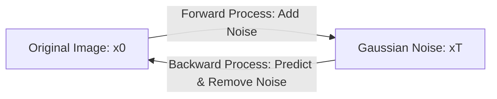

# Project 5: Build a Multi-modal Generation Agent - Textbook-Level Lecture Notes

[← กลับสู่หน้าหลัก (README.md)](../README.md)

---

## 1. Generative Models Foundations (รากฐานคณิตศาสตร์ของโมเดลเชิงสร้างสรรค์)

การทำความเข้าใจสถาปัตยกรรมมัลติโมดัล (Multimodal) ต้องการความรู้ลึกในฝั่งโครงข่ายความน่าจะเป็น
(Probabilistic Generative Models) เพื่อทำแผนภูมิการแจกแจงตัวแปรความสุนทรีย์ของรูปภาพ

### 1.1 VAE (Variational Autoencoder) และการหาขอบเขต ELBO

เป้าหมายของ VAE คือการเพิ่มค่าความน่าจะเป็นสะสมของข้อมูล $\log p(x)$
ภายใต้การจำลองตัวแปรแฝง (Latent Variable $z$) เนื่องจากเราไม่สามารถวิเคราะห์ค่าจริงได้ตรง
ๆ ([Intractable Integral](../glossary/intractable_integral.md))
เราจึงต้องใช้ตัวแทนการกระจายตัวประมาณการ $q_\phi(z \mid x)$
เพื่อหาค่าขอบเขตล่างทางคณิตศาสตร์ที่เรียกว่า **ELBO (Evidence Lower Bound)**:

$$\log p_\theta(x) \ge \mathbb{E}_{q_\phi(z \mid x)}[\log p_\theta(x \mid z)] - \mathbb{D}_{\text{KL}}(q_\phi(z \mid x) \parallel p(z))$$

- **Reconstruction Loss (พจน์แรก)**:
  คาดคะเนความคล้ายคลึงระหว่างภาพต้นฉบับกับภาพที่สร้างใหม่จาก Decoder
- **KL Divergence (พจน์สอง)**: บังคับการกระจายตัวแปรของ Latent space
  ให้ลู่เข้าสู่การแจกแจงปกติมาตรฐาน
  ([Standard Normal Distribution](../glossary/standard_normal_distribution.md)
  $\mathcal{N}(0, \mathbf{I})$) เพื่อให้ง่ายต่อการหยิบนำไปสุ่มต่อ

---

### 1.2 GAN (Generative Adversarial Network)

ทฤษฎีการแข่งขันแบบเป็นศัตรู (Adversarial Training) ระหว่าง Generator ($G$) และ
Discriminator ($D$) แสดงผ่านสมการเกมที่มีคะแนนผลรวมเท่ากับศูนย์
([Minimax Game](../glossary/minimax_game.md)):

$$\min_G \max_D V(D, G) = \mathbb{E}_{x \sim p_{\text{data}}}[\log D(x)] + \mathbb{E}_{z \sim p_z}[\log(1 - D(G(z)))]$$

- Discriminator ($D$) พยายามปรับแต่งน้ำหนักเพื่อให้จำแนกรูปภาพจริง $x$ เป็นจริง ($1$)
  และรูปภาพปลอม $G(z)$ เป็นเท็จ ($0$)
- Generator ($G$) พยายามส่งภาพเข้าประลองเพื่อหลอก $D$ ให้ได้ระดับผลลัพธ์ใกล้เคียง $1$
  มากที่สุด

---

## 2. Diffusion Models Deep-Dive (เจาะลึกสมการโมเดลแพร่กระจาย)

โมเดลแพร่กระจายสัญญาณรบกวน (Diffusion Models) ทำงานผ่านกระบวนการหลักสองขั้นตอนขนานกัน



### 2.1 Forward Process (กระบวนการแพร่สัญญาณไปข้างหน้า)

เป็นห่วงโซ่มาร์คอฟ ([Markov Chain](../glossary/markov_chain.md)) ที่ค่อย ๆ
ป้อนสัญญาณรบกวน (Gaussian noise) ลงบนภาพจริง $x_0$
ทีละระดับเวลาตามกำหนดอัตราความแปรปรวน (Variance schedule
$\beta_1, \dots, \beta_T$):

$$q(x_t \mid x_{t-1}) = \mathcal{N}(x_t; \sqrt{1 - \beta_t} x_{t-1}, \beta_t \mathbf{I})$$

คุณสมบัติทางคณิตศาสตร์ที่พิเศษคือ เราสามารถข้ามขั้นคำนวณเวกเตอร์ $x_t$ ณ ระดับเวลาใด ๆ
จากข้อมูลรูปภาพเริ่มต้น $x_0$ ได้โดยตรงโดยไม่ต้องคำนวณผ่านขั้นตอนย่อยสะสม:

$$q(x_t \mid x_0) = \mathcal{N}(x_t; \sqrt{\bar{\alpha}_t} x_0, (1 - \bar{\alpha}_t) \mathbf{I})$$

โดยที่
$\alpha_t = 1 - \beta_t$
และ
$\bar{\alpha}_t = \prod_{s=1}^t \alpha_s$

> [!TIP]
> **Code Example:** ลองรันโค้ดคณิตศาสตร์ของการเติม Noise ลงในรูปภาพ (Forward Process)
> ได้ที่ไฟล์
> [project5_diffusion_forward_process.py](../code/project5_diffusion_forward_process.py)
>
> ```python
> # ตัวอย่างการข้ามขั้นเวลา t แบบรวดเดียว (ดูโค้ดเต็มในลิงก์ด้านบน)
> def forward_diffusion_sample(x_0, t, betas):
>     alphas = 1.0 - betas
>     alphas_cumprod = np.cumprod(alphas)
>     alpha_bar_t = alphas_cumprod[t]
>
>     noise = np.random.randn(*x_0.shape)
>     x_t = np.sqrt(alpha_bar_t) * x_0 + np.sqrt(1.0 - alpha_bar_t) * noise
>     return x_t, noise
> ```

---

### 2.2 Backward Process & Noise Prediction Loss (กระบวนการถอยกลับย้อนคืน)

เป้าหมายคือการเทรนโครงข่ายประสาทเทียม $\epsilon_\theta$
ให้พยากรณ์สัญญาณรบกวนที่เพิ่มเข้าไปในกระบวนการ Forward process
เพื่อนำมาทำความสะอาดรูปภาพแบบย้อนรอย

ฟังก์ชันสูญเสียที่ได้รับความนิยมคือ Mean Squared Error ของโมเดลคาดคะเนสัญญาณรบกวน:

$$\mathcal{L}_{\text{simple}}(\theta) = \mathbb{E}_{t, x_0, \epsilon} \left[ \| \epsilon - \epsilon_\theta(x_t, t, c) \|^2 \right]$$

โดยที่ $x_t = \sqrt{\bar{\alpha}_t} x_0 + \sqrt{1 - \bar{\alpha}_t} \epsilon$ และ
$c$ คือเวกเตอร์เงื่อนไข เช่น ข้อมูลข้อความจากการแปลง Text Embedding

---

### 2.3 Diffusion Samplers (ตัวถอดรหัสและการแก้ไขสมการอนุพันธ์)

การคำนวณภาพคืนรูปดิบ (Sampling) สามารถมองได้ว่าเป็นการประมาณค่าสมการอนุพันธ์ย่อยเชิงสถิติ
(Stochastic Differential Equation - [SDE](../glossary/sde_ode.md))
หรือระบบอนุพันธ์แบบกำหนดทิศทาง (Ordinary Differential Equation -
[ODE](../glossary/sde_ode.md)):

- **DDPM (Denoising Diffusion Probabilistic Models)**:
  การสุ่มแบบห่วงโซ่มาร์คอฟดั้งเดิมที่มีการใส่สัญญาณรบกวนสุ่มย่อยในทุกรอบ
  ส่งผลให้คำตอบแกว่งและต้องรันถึง 1,000 รอบ
- **DDIM (Denoising Diffusion Implicit Models)**:
  สุ่มผ่านการติดตามเส้นโค้งการแจกแจงแบบกึ่งกำหนดค่า (Deterministic ODE trajectory)
  ทำให้สามารถข้ามขั้นตอนการสุ่มได้ลึก เหลือจำนวนรอบเพียง 20-50 รอบ
- **Flow Matching / Rectified Flow**:
  กำหนดแนวทางการลดสัญญาณรบกวนแบบลากเส้นผ่านระยะทางสั้นที่สุด (Straight ODE path)
  ระหว่างจุดสุ่ม $x_0 \sim p_0$ (Noise) ไปยัง $x_1 \sim p_1$ (Data):
  $$x_t = (1-t) x_0 + t x_1$$
  และเป้าหมายการเทรนคือทำให้โมเดลพยากรณ์ค่าความแรงเวกเตอร์ความเร็ว (Target velocity
  vector) $v_t = x_1 - x_0$ วิธีนี้ทำให้โมเดลสามารถสร้างภาพคมชัดสูงมากได้ใน 10-15
  ขั้นตอนการสุ่ม (ตัวอย่างโมเดลเช่น FLUX.1 และ Stable Diffusion 3)

---

### 2.4 Diffusion Architectures: U-Net vs DiT (Diffusion Transformer)

- **U-Net**: สถาปัตยกรรมแบบ Convolutional ดั้งเดิมที่มี Spatial pooling
  เพื่อบีบอัดและถอดรหัส มีข้อจำกัดในการรองรับข้อมูลบริบทขนาดใหญ่และการทำนายเชิงเวลา
- **DiT**: แบ่ง Latent space ขนาด $C \times H \times W$ ออกเป็น Patches ขนาดเล็ก
  แปลงแต่ละก้อนไปสู่ 1D เวกเตอร์ (Token) จากนั้นแนบข้อมูลความถี่ระดับเวลา $t$ (Time
  embedding) และข้อมูลพร้อมต์ข้อความผ่านกลไก Cross-Attention ในสถาปัตยกรรมแบบ
  Transformer ทั้งหมด
  ส่งผลให้โมเดลมีเสถียรภาพและคุณภาพผลงานที่ดีกว่าตามระดับความใหญ่ของพารามิเตอร์

---

## 3. Image Generation Evaluation Metrics (คณิตศาสตร์ตัวประเมินภาพ)

### 3.1 FID (Fréchet Inception Distance)

FID ประเมินความสมจริงของรูปภาพที่สร้างขึ้นเทียบกับกลุ่มรูปภาพอ้างอิงจริง
โดยสกัดฟีเจอร์เวกเตอร์ผ่านชั้นสุดท้ายของโมเดลคัดแยกภาพ Inception-v3 คำนวณจากระยะห่าง
Fréchet ระหว่างสองการแจกแจงปกติหลายตัวแปร (Multivariate Gaussian Distributions):

$$d^2 = \|\mu_r - \mu_g\|_2^2 + \text{Tr}\left(\Sigma_r + \Sigma_g - 2(\Sigma_r \Sigma_g)^{1/2}\right)$$

โดยที่:

- $\mu_r, \Sigma_r$ คือค่าเฉลี่ยและเมทริกซ์ความแปรปรวนร่วมของกลุ่มภาพจริง (Real)
- $\mu_g, \Sigma_g$ คือค่าเฉลี่ยและเมทริกซ์ความแปรปรวนร่วมของกลุ่มภาพที่สร้างขึ้น (Generated)
- $\text{Tr}$ คือฟังก์ชันร่องรอยของเมทริกซ์ ([Trace](../glossary/trace.md) -
  ผลบวกสมาชิกในแนวทแยงมุมหลัก)

---

### 3.2 IS (Inception Score)

IS วัดประสิทธิภาพการสร้างรูปภาพโดยเน้นความคมชัดของวัตถุเดี่ยว (Sharpness)
และความหลากหลายของสิ่งของที่สร้างขึ้น (Diversity):

$$\text{IS}(G) = \exp\left( \mathbb{E}_{x \sim p_g} [ \mathbb{D}_{\text{KL}}(p(y \mid x) \parallel p(y)) ] \right)$$

โดยที่:

- $p(y \mid x)$ คือความชัดเจนเชิงคลาสของวัตถุในรูปภาพเป้าหมาย $x$
- $p(y) = \int p(y \mid x) \mathrm{d}p_g(x)$
  คือการแจกแจงความน่าจะเป็นเฉลี่ยของคลาสทั้งหมดในคลัง

---

## 4. Text-to-Video (T2V) (การสร้างภาพเคลื่อนไหวระดับวิศวกรรม)

ในการรันสถาปัตยกรรมภาพเคลื่อนไหว เราจำเป็นต้องพิจารณาพื้นที่มิติข้อมูลแบบ 3 มิติ (ความกว้าง,
ความสูง, ลำดับเวลา)

### 4.1 Spatial-Temporal Attention (ความใส่ใจร่วมเชิงตำแหน่งและเวลา)

การจัดสรรพื้นที่ความใส่ใจในการคำนวณวิดีโอมีสองรูปแบบหลักในสถาปัตยกรรม DiT:

- **Joint Space-Time Attention**: นำแผ่นย่อยพิกเซลของทุกเฟรมทั้งหมดมาต่อเป็นเส้นยาวและทำ
  Attention ร่วมกันเป็นแผ่นเดียว ให้คุณภาพทัศนียภาพที่กลมกลืนที่สุด แต่ใช้ Memory สูงมาก
  ($O((F \times N)^2)$ โดยที่ $F$ คือจำนวนเฟรม และ $N$ คือจำนวน Patch ต่อเฟรม)
- **Factorized Space-Time Attention**: แยกชั้นประมวลผลเป็นสองส่วนขนานกัน โดยทำ
  Spatial attention เฉพาะภายในภาพเฟรมเดียวกันก่อน จากนั้นจึงส่งผลลัพธ์ผ่านบล็อก Temporal
  attention เพื่อเชื่อมความสอดคล้องข้ามเฟรมตามแนวเวลา วิธีนี้ช่วยลด Memory ลงเหลือ
  $O(F^2 + N^2)$

---

[← กลับสู่หน้าหลัก (README.md)](../README.md)
