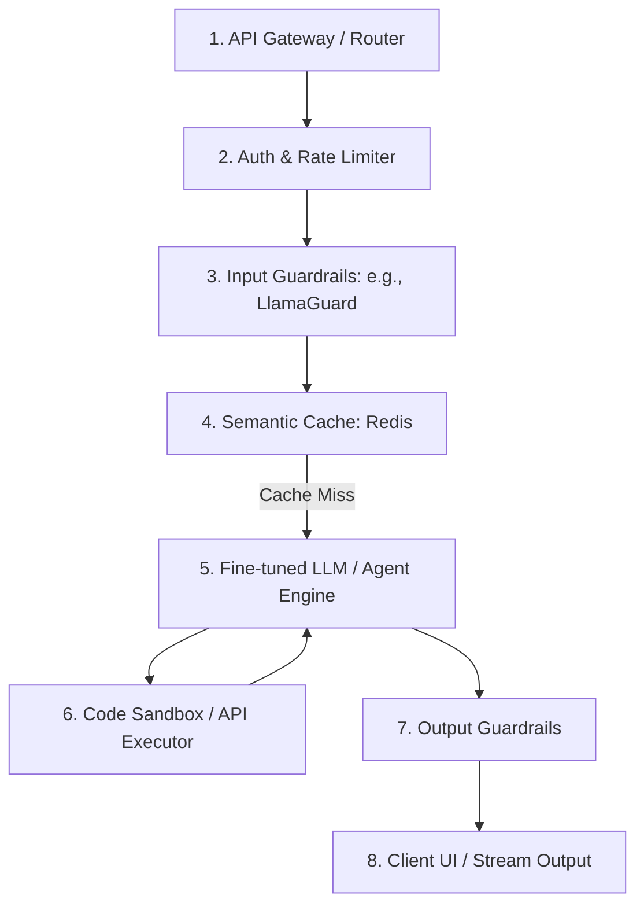

# Project 6: Capstone Project - Textbook-Level Lecture Notes & Guidelines

[← กลับสู่หน้าหลัก (README.md)](../README.md)

---

## 1. การวางหลักการโครงงานพอร์ตโฟลิโอ (Portfolio Project Blueprint)

Capstone Project ไม่ใช่เพียงแค่แบบฝึกหัดเรียนจบ
แต่เป็นสิ่งท้าทายความสามารถทางวิศวกรรมปัญญาประดิษฐ์เชิงประจักษ์ (Proof of Engineering Rigor)
สำหรับใช้ประกอบการพิจารณาเข้าทำงานในระดับผู้เชี่ยวชาญ

### 1.1 มิติความซับซ้อนทางวิศวกรรม (Engineering Complexity Dimensions)

โปรเจกต์ระดับพอร์ตโฟลิโอที่ดีต้องประกอบด้วยหัวข้อประเมินความซับซ้อนดังนี้:

- **Data Pipeline Complexity**:
  การสร้างสตรีมข้อมูลที่จัดการประมวลผลเอกสารหรือข้อมูลเข้าแบบเรียลไทม์ (Streaming data
  pipelines) พร้อมการทำคลีนนิ่งล่วงหน้าอย่างอัตโนมัติ
- **System [Latency](../glossary/latency_throughput.md) & Optimization**:
  เทคนิคการเพิ่มความเร็วในการประมวลผลคำตอบ (เช่น การทำ Streaming output, การจัดการเก็บ
  cache เวกเตอร์, หรือการใช้ vLLM จัดการ PagedAttention)
- **Production Guardrails**: ติดตั้งโมเดลคัดกรองความปลอดภัยและการควบคุมข้อมูลลั่วไหล
  ([PII](../glossary/pii.md)) ทั้งฝั่งขาเข้าและขาออก

---

## 2. พิมพ์เขียวสถาปัตยกรรมและการจัดการระดับสูง (Production Blueprints)

เมื่อออกแบบระบบในระดับโปรดักชัน (Production-grade AI systems)
โครงสร้างสถาปัตยกรรมต้องแยกส่วนความน่าจะเป็นออกจากส่วนที่มีความแน่นอน:



### 2.1 ส่วนประกอบทางวิศวกรรมที่สำคัญ:

1. **Rate Limiting & Cost Management**:
   กำหนดโควตาการประมวลผลคำสั่งตามสิทธิ์พนักงานหรือผู้ใช้ เพื่อป้องกันสภาวะระบบล่ม (DDOS)
   และควบคุมปริมาณค่าใช้จ่าย API คลาวด์สะสม
2. **Semantic Caching (การใช้แคชเชิงความหมาย)**:
   การส่งผ่านคำถามของผู้ใช้ใหม่เข้าไปในคลังเวกเตอร์ความจุเล็ก (เช่น Redis)
   หากพบคำถามในอดีตที่มีเนื้อความใกล้เคียงกันมาก (เช่น Cosine Similarity $> 0.95$)
   ระบบสามารถดึงประโยคคำตอบเดิมมาตอบได้ทันทีโดยไม่ต้องรัน LLM ประหยัดทั้งเวลาและค่าโทเคน
3. **Code Sandboxing**: เมื่อมีการอนุญาตให้เอเจนต์เขียนโปรแกรมแก้โจทย์ด้วยตนเอง
   ตัวโค้ดจะต้องถูกประมวลผลภายในสภาพแวดล้อมเสมือนแยกส่วนเด็ดขาด (เช่น gVisor หรือ WASM
   Runtime) เพื่อป้องกันไม่ให้เกิดความเสียหายต่อระบบไฟล์ภายในเครื่องเซิร์ฟเวอร์หลัก

> [!TIP]
> **Code Example:** อยากรู้ไหมว่า Semantic Caching ทำงานอย่างไรด้วย Cosine
> Similarity? ลองดูโครงสร้างโค้ดจำลองได้ที่
> [project6_semantic_cache.py](../code/project6_semantic_cache.py)
>
> ```python
> # ตัวอย่างการทำ Cache Hit (ดูโค้ดเต็มในลิงก์ด้านบน)
> def check_cache(self, query_embedding):
>     for entry in self.cache_db:
>         sim = cosine_similarity(query_embedding, entry['embedding'])
>         if sim > self.threshold:
>             return entry['response'] # Cache Hit! ไม่ต้องรัน LLM
>     return None
> ```

---

## 3. ระบบทดสอบวัดผลเชิงคุณภาพและปริมาณ (Robust Evaluation Framework)

หัวใจสำคัญที่แยกแยะระหว่างโปรแกรมเมอร์ทั่วไปและ **AI Engineer**
คือการประเมินประสิทธิภาพระบบอย่างเป็นรูปธรรมทางคณิตศาสตร์ (Data-Driven Iteration)

### 3.1 การสร้างชุดทดสอบจำลอง (Golden Dataset)

ต้องรวบรวมตัวอย่างคำถาม คำตอบเฉลยอ้างอิง (Ground Truth) และบริบทหลักที่จำเป็นอย่างน้อย
100-200 ข้อ เพื่อใช้เป็นเกณฑ์ตัดสินนวัตกรรมใหม่ที่นำมาเสริมในระบบ

### 3.2 [CI/CD](../glossary/cicd.md) สำหรับ LLM (Continuous Evaluation Pipeline)

จัดตั้งขั้นตอนตรวจคะแนนประเมินผลอัตโนมัติ (เช่น การเชื่อม Ragas หรือ TruLens ใน GitHub
Actions):

- ทุกครั้งที่วิศวกรทำการส่งโค้ดแก้พฤติกรรมพร้อมต์หรือเปลี่ยนโครงร่าง chunk
  ระบบจะยิงรันแบบจำลองคำถามกับโมเดล และวัดคะแนนสถิติสะสม
- หากค่าเฉลียของคะแนน **Faithfulness** ต่ำกว่า 0.85 หรือ **Answer Correctness**
  ลดลงเกินขีดจำกัด ตัวระบบจะไม่ปล่อยผ่าน (Merge Blocked)
  ป้องกันปัญหาพฤติกรรมโมเดลเบี้ยวเสื่อมถอย (Regression)

---

## 4. วิศวกรรมระบบความปลอดภัยและตรวจติดตาม (Security & Monitoring)

### 4.1 Input & Output Guardrails

- **Llama Guard**:
  ใช้โมเดลภาษาขนาดเล็กที่ถูกเทรนพิเศษเพื่อวิเคราะห์ว่าข้อความพร้อมต์ของผู้ใช้หรือคำตอบของระบบ
  มีข้อมูลสุ่มเสี่ยง ละเมิดสิทธิส่วนบุคคล หรือข้อความอันตรายหรือไม่
- **NeMo Guardrails**: การควบคุมทิศทางการตอบแชตบอตไม่ให้ออกนอกลู่หรือนำไปล้อเลียนแบรนด์
  โดยใช้เงื่อนไขการตรวจสอบแบบ State machine คอยดึงคำสนทนากลับเข้าประเด็นหลัก

### 4.2 ระบบตรวจติดตามเชิงลึก (Observability)

- **OpenLLMetry / LangFuse**: การบันทึกและเชื่อมข้อมูลทรานแซกชัน (Traces) ของทุก ๆ
  การรันเอเจนต์อย่างละเอียด:
  - ลำดับระยะเวลาประมวลผลในแต่ละโหนด (Trace Latency)
  - จำนวน Token ที่สูญเสียไปในการรันเครื่องมือแต่ละรอบ
  - ตรวจหาจุดเกิดปัญหาความล้มเหลว (Error point) ในสายเครื่องมืออัตโนมัติแบบเรียลไทม์

---

## 5. การจัดแสดงผลและการสรุปโปรเจกต์ (Demo Day Pitching)

- **Engineering Slides**: อธิบายลอจิกสถาปัตยกรรม ปัญหาคอขวดที่พบ (เช่น
  [Latency](../glossary/latency_throughput.md) Spike)
  และวิเคราะห์สถิติวัดผลเปรียบเทียบในรูปกราฟตัวเลข
- **Live Web Demonstration**:
  ระบบควรโฮสต์ไว้บนคลาวด์สาธารณะและมีลิงก์ทดสอบตรงเพื่อให้ผู้คนสามารถลองสุ่มพิมพ์ตรวจสอบการทำงาน
  และรับประสบการณ์สด (Real-time feedback) ของระบบด้วยตนเอง

---

[← กลับสู่หน้าหลัก (README.md)](../README.md)
